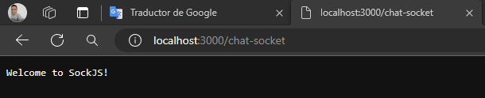

# WebSocket en Spring Boot

--- 

## Dependencias

````xml
<!--Spring Boot 3.2.4-->
<!--Java 21-->
<dependencies>
    <dependency>
        <groupId>org.springframework.boot</groupId>
        <artifactId>spring-boot-starter-web</artifactId>
    </dependency>
    <dependency>
        <groupId>org.springframework.boot</groupId>
        <artifactId>spring-boot-starter-websocket</artifactId>
    </dependency>

    <dependency>
        <groupId>org.projectlombok</groupId>
        <artifactId>lombok</artifactId>
        <optional>true</optional>
    </dependency>
    <dependency>
        <groupId>org.springframework.boot</groupId>
        <artifactId>spring-boot-starter-test</artifactId>
        <scope>test</scope>
    </dependency>
</dependencies>
````

## Configurando application.yml

````yml
server:
  port: 3000
  error:
    include-message: always

spring:
  application:
    name: spring-boot-websocket-chat
````

## Configurando WebSocket

`@EnableWebSocketManagerBroker`, permitirá configurar un broker para la comunicación con los clientes.

Agregue esta anotación a una clase `@Configuration` para habilitar la mensajería respaldada por un agente a través de
`WebSocket` utilizando un subprotocolo de mensajería de nivel superior.

Para personalizar la configuración importada debemos implementar la interfaz `WebSocketMessageBrokerConfigurer`:

````java

@Configuration
@EnableWebSocketMessageBroker
public class WebSocketConfiguration implements WebSocketMessageBrokerConfigurer {

    @Override
    public void registerStompEndpoints(StompEndpointRegistry registry) {
        registry.addEndpoint("/chat-socket") // El frontEnd con qué path va a conectarse a mi servidor socket
                .setAllowedOrigins("http://localhost:4200") // Qué clientes pueden conectarse a este endpoint
                .withSockJS(); // Librería a usar en el frontend
    }

    /**
     * Nos permite habilitar un broker, que será el que nos permita la comunicación
     * entre los clientes y el servidor
     */
    @Override
    public void configureMessageBroker(MessageBrokerRegistry registry) {
        registry.enableSimpleBroker("/topic");// Mediante qué path van a ingresar a este broker
        registry.setApplicationDestinationPrefixes("/app"); // Path de destino de mensajes, por dónde la aplicación va a estar destinando los mensajes
    }
}
````

## Creando DTO

Crearemos un `DTO` para trabajar con los mensajes que nos llegan del frontEnd:

````java
public record ChatMessage(String message, String user) {
}
````

## Creando controlador

````java

@Controller
public class WebSocketController {

    /**
     * @DestinationVariable, anotación que indica que un parámetro de método debe estar
     * vinculado a una variable de plantilla en una cadena de plantilla de destino.
     * Compatible con métodos de manejo de mensajes como @MessageMapping.
     * <p>
     * Siempre se requiere una variable de plantilla @DestinationVariable.
     */
    @MessageMapping("/chat/{roomId}")
    @SendTo("/topic/{roomId}") // A dónde vamos a redireccionar
    public ChatMessage chat(@DestinationVariable String roomId, ChatMessage message) {
        return message;
    }
}
````

## Ejecutando aplicación

Si hasta este punto ejecutamos la aplicación y accedemos al endpoint `http://localhost:3000/chat-socket`, observaremos
lo siguiente:

